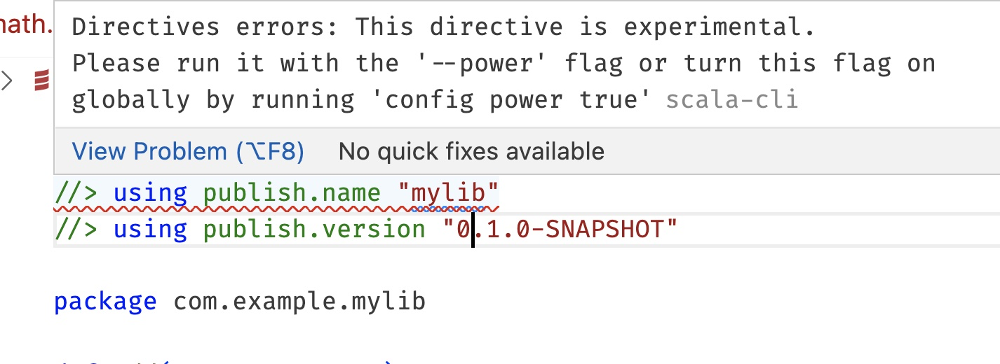

# Scala-CLI vs SBT

This repository aims at evaluating the usage of Scala-CLI bs SBT for teaching Scala, specifically in the context of the CS-210 Software Construction course at EPFL in September 2023. It contains examples of setting up a library, testing it, publishing it locally and using it from another project, both using Scala-CLI and SBT.

## Usage

Working directory for all following commands is assumed to be the root of this repository.

### Scala-CLI

> **Note**
> Not sure about “best-practice” folder structure for Scala-CLI projects. Should hierarchy follow packages structure like in SBT or Java projects?

#### Test `mylib`

```
scala-cli --power test scala-cli/mylib
```

#### Publish `mylib` locally

```
scala-cli --power publish local scala-cli/mylib
```

Documentation: https://scala-cli.virtuslab.org/docs/commands/publishing/publish-local/.

#### Run `myproject`

To open `myproject` in VSCode:

```
scala-cli scala-cli/myproject
```

### SBT

Example project: https://github.com/scala/scala3-example-project.

> **Note**
> Is it required and/or recommended to prefix some options with `ThisBuild /`? What is the default scope if no prefix?

#### Test `mylib`

```
cd sbt/mylib
sbt test
```

#### Publish `mylib` locally

```
cd sbt/mylib
sbt publishLocal
```

Documentation: https://www.scala-sbt.org/1.x/docs/Publishing.html#Publishing+locally.

#### Run `myproject`

```
cd sbt/myproject
sbt run
```

### Extra

#### List JAR content

```
jar -tf ~/.ivy2/local/com.example/mylib_3/0.1.0-SNAPSHOT/jars/mylib_3.jar
```

## Evaluation

### Speed (Scala-CLI wins)

Quick data points (just single measures on my MacBook Pro Intel):

- Time to compile:
    - Scala-CLI: 1 s (`time scala-cli --power compile scala-cli/mylib`)
    - SBT: 10 s (`cd sbt/mylib; time sbt compile`)
- Time to open `mylib` in VSCode (project already compiled, time from `code mylib` to “Finished indexing”):
    - Scala-CLI: 12 s
    - SBT: 28 s

### Ease of use (Scala-CLI wins?)

- Scala-CLI is known to be easier to use. Note: that this is not so obvious in this simple setup. The number of configuration lines between Scala-CLI and SBT is about the same.
- Ease of use might not necessarily be a positive criteria anyway. It makes more sense to teach the students the “hard parts” and let them figure out the easier ones than the opposite.
- It is suggested to run `setup-ide` to use a project with Scala-CLI. Is this extra step still needed? It seems we can just open the project in VSCode without running it.

### Stability and maturity (SBT wins)

- The `publish` command in Scala-CLI is still in alpha and will take some time (probably after September?) to be stabilized. Currently, it is required to use the `--power` flag to use it. Furthermore, this flag is transitively needed for core commands as well: `scala-cli test --power scala-cli/mylib`. Errors for power options are also shown in VSCode. Is there a project-level option to disable such errors? (There is a global option to enable power mode, but a local one would be more appropriate here.)

  
- Scala-CLI currently shows superfluous warnings for `using` directives in several files. This will be fixed.

### Real-world usage (SBT wins)

Scala-CLI is a young tool. SBT is still much more used in the wild. It means there are more StackOverflow posts and tutorials about SBT. Also, students will be able to contribute to more projects if they know SBT.

### IDE support (SBT wins)

1. IIRC, IntelliJ doesn't support Scala-CLI yet, or not completely? Do we have an ETA?
1. In VSCode, worksheets in an SBT project can automatically access dependencies form `buid.sbt`. Using Scala-CLI, `using` directives are not yet supported in worksheets (only non-standard Ammonite-style imports). Feature request: https://github.com/scalameta/metals-feature-requests/issues/308.
